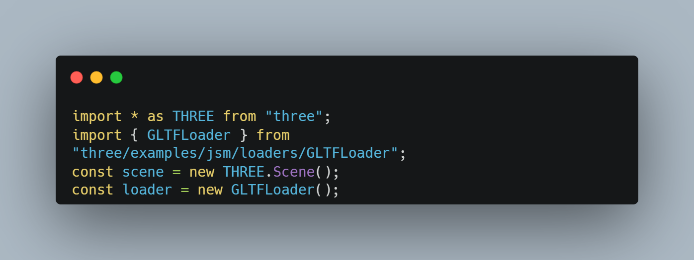

Three.js ilə 3D Model Görsətmənin Ən Sürətli Yolu
-------------------------------------------------
Veb səhifələrində interaktivlik əlavə etmək istəyirsinizsə, Three.js sizin yanınızdadır :) Three.js, çox güclü bir 3D qrafika kitabxanasıdır və onun köməyi ilə veb səhifələrində 3D model göstərmək çox sadədir. Bu blogda, Three.js kitabxanasının necə istifadə ediləcəyini öyrənəcəyik.Məlumdur ki, Novruz bayramıdır və biz bayram münasibəti ilə saytımıza 3D səməni əlavə edəcəyik.

* * *

İlk olaraq sadə bir html faylı və ona bağlı bir javascript yaradırıq.

Növbəti addımda isə biz istifadə edəcəyimiz alətləri yəni three.js və vite.js-i saytımıza yerləşdirməliyik.Bunu necə edəcəyimiz three.js bloqunda yazılıb.Mən isə vaxt almadan npm vasitəsi ilə hər ikisini yükləyəcəm :)

**`npm i three`**  
**`npm i vite`**

* * *

Əhsən,indi isə html fayl strukturumuzu yazaq...

Mən bir neçə bəsit css kodları yazdım və javascript faylını module formatında html səhifəmə birləşdirdim. İndi isə işin əsas mərhələsinə keçək.

* * *

Bir dəqiqə,hansı iş?) bizim hələ 3D formatında səmənimiz yoxdur axı. Mən bunun üçün blender proqramı vasitəsi ilə 3D səməni hazırladım və onu glb formatında öz komputerimə yüklədim və onu fayllar olan qovluğa əlavə etdim.

* * *

Və artıq hərşey hazırdır.Başlayaq əsas kodları yazmağa ;)

* * *

İlk olaraq, 3D modeli göstərmək üçün bir Three.js sahəsi yaradırıq və GLTFLoader-i yükləyirik.

* * *

Bir neçə addımdan sonra modelimiz hazırdır

* * *

### 1\. Modelin Yüklənməsi:

GLTFLoader vasitəsilə 3D modeli yükləyirik. Yükləmə uğurlu olduğu təqdirdə, modeli sahəyə əlavə edirik və onun pozisiyasını təyin edirik.

* * *

### 2\. Işıqlandırma:

Sahəyə ambiyans və işıqlar əlavə edərik.

* * *

### 3\. Kamera və Renderer:

Kamera və renderer, bizə modelimizi ekranda görüntüləmək üçün lazımlıdır.

* * *

### 4\. Son funksiya:

Artıq modelimiz hazırdı.İndi isə modeli ekranda göstərmək üçün funksiya yazıb onu çağıraq

* * *

Artıq 3D modelimiz hazırdır.Modeli görmək üçün terminalda **`npx vite`** yazırıq.Gəlin nəticəyə bərabər baxaq

* * *

İndi isə sizə bu 3D modeli fırladıb ətraflı görə bilməyiniz üçün bir funksiya yazıram

**Artıq 3D səməni modeli hazırdır.Ümid edirəm ki, sizin üçündə maraqlı oldu.Növbəti bloglarda görüşmək diləyi ilə**

